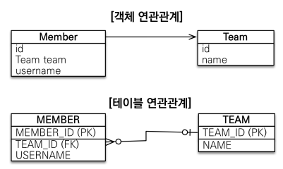

# JPA란?

## SQL 중심적인 개발의 문제점

- CRUD의 반복 …
- 자바 객체를 SQL로, SQL을 자바 객체로 변환해야할 일이 많음.
- 필드를 추가할 때 연관된 쿼리들을 모두 수정해야 함

## 객체와 관계형 데이터베이스의 차이 (패러다임의 불일치)

- 관계형 DB의 목표 : 데이터를 잘 **정규화해서 저장**하는 것이 목표
- 객체의 목표 : 속성과 기능을 묶어서 **캡슐화해서 사용**하는 것이 목표

### 상속

- 객체는 상속을 통해 부모자식 관계를 지을 수 있다.
- 관계형 데이터베이스는 슈퍼타입과 서브타입을 통해 상속과 유사한 관계를 지을 수 있다.
    
    → 하지만 별개의 테이블에 들어가고 INSERT가 2번 또는 그 이상 해야하며, 조회시에는 Join을 걸어야해서 복잡해진다. 
    

### 연관관계



연관관계 예시

- 객체는 참조(레퍼런스)를 통해 연관관계를 지을 수 있음
- 관계형 데이터베이스는 외래 키를 사용하여 Join으로 관계를 지을 수 있음.
- 객체는 필요할 때마다 간단하게 조회를 할 수 있고, 연관관계가 있는 객체를 쉽게 불러올 수 있다.
    
    ```java
    Member member = list.get(memberId);
    Team team = member.getTeam();
    ```
    
- 관계형 데이터베이스를 사용할 경우 Join을 통해 받아온 결과를 각각의 객체에 매핑하고, 관계를 설정하는 일련의 과정이 있어야 한다.
    
    ```java
    SELECT M.*, T.* FROM MEMBER M JOIN TEAM T
    ON M.TEAM_ID = T.TEAM_ID
    
    public Member find(String memberId) {
    	//SQL 실행
    	Member member = new Member();
    	//회원 관련 정보를 모두 매핑
    	Team team = new Team();
    	//팀 관련 정보를 모두 매핑
    
    	member.setTeam(team);
    	return member;
    }
    ```
    

### 객체 그래프 탐색


- 객체는 자유롭게 객체 그래프를 탐색할 수 있어야 한다.
- 서로 참조가 있다는 가정하에서는 연관된 것들 끼리 접근이 가능해야한다.
- 하지만 관계형 데이터베이스에서는 불가능하다. 처음 실행하는 SQL에 따라 탐색 범위가 결정되기 때문이다.
    
    ```java
    SELECT M.*, T.* FROM MEMBER M JOIN TEAM T
    ON M.TEAM_ID = T.TEAM_ID
    
    class MemberService {
    	public void process() {
    			Member mebmer = memberDAO.find(memberId)
    			member.getTeam(); 
    			member.getOrder().getDeleivery();
    		}
    }
    ```
    
    - 엔티티의 신뢰문제가 발생한다.
    - 반환된 객체가 무엇을 반환해 주는지 알 수가 없기 때문에 코드를 직접 보지않는 이상  위와 같이 사용할 수 없다.
    - 따라서 진정한 의미의 계층 분할이 어렵다.

## JPA란?

- 자바 진영의 ORM 표준
- ORM ? → Object Relational Mapping (객체 관계 매핑)
    - 객체는 객체대로 설계
    - 관계형 데이터베이스는 관계형 데이터베이스대로 설계
    - ORM 프레임워크가 중간에서 매핑
- JPA의 동작 원리
    - 저장
        
        
        
        - JPA에게 Member 객체를 넘김 → JPA가 Entity를 분석 → INSERT 쿼리 생성 →  JDBC API를 통해 DB에 저장
    - 조회
        
        
        
        - PK값을 JPA에게 넘김 → JPA가 SELECT 쿼리 생성 → JDBC API를 통해 DB에 요청 → ResultSet에 매핑
- JPA 이전 기술
    - EJB → 엔티티 빈
        - 인터페이스를 너무 상속 받고 구현해야해서 불편했음.
        - 성능 이슈도 있었음
    - 하이버네이트
        - EJB에 불편을 느낀 개발자가 만든 ORM 프레임워크
    - JPA
        - 인터페이스의 모음임.

### JPA를 왜 사용해야 하는가 ?

- SQL 중심적인 개발에서 객체 중심으로 개발
- 생산성
    - CRUD가 이미 다 만들어져 있음.
- 유지보수
    - 기존에는 테이블에 필드 변경시 모든 SQL 수정해야함.
    - JPA를 사용하면 필드만 추가하면 수정할 것이 없음.
- 패러다임의 불일치 해결
    
    
    
- 상속

    

- JPA연관관계
- 객체 그래프 탐색
    - JPA는 지연로딩이란 기능이 있어서 자유롭게 객체 그래프를 탐색할 수 있음.
- 비교하기
    - 동일한 트랜잭션에서 조회한 엔티티는 같음을 보장

### JPA의 성능 최적화 기능

- 1차 캐시와 동일성 보장
    
    ```java
    String memberId = "1000";
    Member m1 = jpa.find(Member.class, memberId) // SQL
    Member m2 = jpa.find(Member.class, memberId) // 캐시
    ```
    
    - 같은 트랜잭션 안에서는 같은 엔티티를 반환
        
        → 약간의 조회 성능 향상
        
        → 하지만 하나의 트랜잭션 안에서만 동일성을 보장하는 것이기 때문에 큰 성능향상은 없음. 
        
    - DB Isolation Level이 Read Commit이어도 애플리케이션에서 Repeatable Read 보장
        
        (※ DB Isolation Level 참고 : [https://labs.brandi.co.kr/2019/06/19/hansj.html](https://labs.brandi.co.kr/2019/06/19/hansj.html)) 
        
- 트랜잭션을 지원하는 쓰기 지연
    
    
    
    - 트랜잭션을 커밋할 때 까지 INSERT SQL을 모음
    - JDBC BATCH SQL 기능을 사용해서 한번에 SQL 전송
- 지연 로딩과 즉시로딩
    
    
    
    - 지연 로딩 : 객체가 실제 사용될 때 로딩
        - 지연로딩의 경우 쿼리가 너무 많이 발생함. (N+1문제)
    - 즉시 로딩 : JOIN SQL로 한번에 연관된 객체까지 미리 조회
