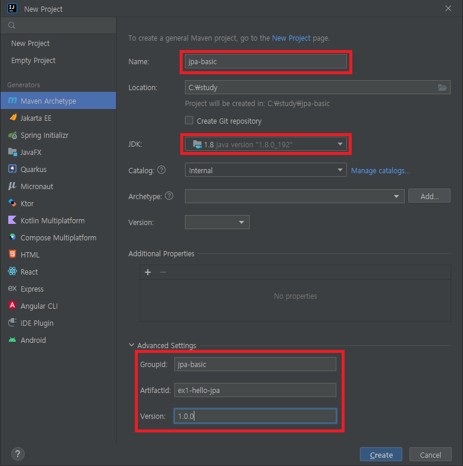

# 프로젝트 생성 실습

## 프로젝트 생성

- 프로젝트 생성 [File → New → Project 클릭]
- 프로젝트 정보 입력
    
    
    
    - Name : 프로젝트 이름 입력
    - JDK : 8버전 이상으로 선택
    - ArtifactId : 빌드 시 생성되는 파일의 이름-
- pom.xml 파일을 통해 프로젝트에 대한 내용을 설정 할 수 있다.
    - 의존 라이브러리를 설정할 수 있다.
    - 아래 내용 추가
        
        ```xml
        <dependencies>
                <!-- JPA 하이버네이트 -->
                <dependency>
                    <groupId>org.hibernate</groupId>
                    <artifactId>hibernate-entitymanager</artifactId>
                    <version>5.3.10.Final</version>
                </dependency>
                <!-- H2 데이터베이스 -->
        				<!-- 로컬에 설치되어 있는 h2와 버전을 맞춰야한다. -->
                <dependency>
                    <groupId>com.h2database</groupId>
                    <artifactId>h2</artifactId>
                    <version>1.4.200</version>
                </dependency>
            </dependencies>
        ```
        

## JPA 설정

- [main - resources - META-INF - persistence.xml]

  ```xml
  <?xml version="1.0" encoding="UTF-8"?> 
  <persistence version="2.2" 
   xmlns="http://xmlns.jcp.org/xml/ns/persistence" xmlns:xsi="http://www.w3.org/2001/XMLSchema-instance" 
   xsi:schemaLocation="http://xmlns.jcp.org/xml/ns/persistence http://xmlns.jcp.org/xml/ns/persistence/persistence_2_2.xsd"> 
   <persistence-unit name="hello"> 
   <properties> 
   <!-- 필수 속성 --> 
   <!-- Database 접근정보 -->
   <property name="javax.persistence.jdbc.driver" value="org.h2.Driver"/> 
   <property name="javax.persistence.jdbc.user" value="sa"/> 
   <property name="javax.persistence.jdbc.password" value=""/> 
   <property name="javax.persistence.jdbc.url" value="jdbc:h2:tcp://localhost/~/test"/> 
   <property name="hibernate.dialect" value="org.hibernate.dialect.H2Dialect"/> 
   
   <!-- 옵션 --> 
   <property name="hibernate.show_sql" value="true"/> 
   <property name="hibernate.format_sql" value="true"/> 
   <property name="hibernate.use_sql_comments" value="true"/> 
   <!--<property name="hibernate.hbm2ddl.auto" value="create" />--> 
   </properties> 
   </persistence-unit> 
  </persistence> 
  ```

- JPA는 특정 데이터베이스에 종속되지 않음.
- javax로 시작하는 설정은 하이버네이트외의 JPA 구현 라이브러리를 사용할 때도 사용할 수 있는 설정


- `hibernate.dialect` : DBMS는 종류에 따라 문법과 함수가 조금씩 다름. 해당 설정을 통해 DBMS 종류를 지정하고, JPA가 알아서 SQL 문법을 해석하고, 생성하도록 지정함.

## JPA 실습

- Member
    
    ```java
    package hellojpa;
    
    import javax.persistence.Entity;
    import javax.persistence.Id;
    
    @Entity
    public class Member {
    
        @Id
        private Long id;
        private String name;
    
        public Long getId() {
            return id;
        }
    
        public void setId(Long id) {
            this.id = id;
        }
    
        public String getName() {
            return name;
        }
    
        public void setName(String name) {
            this.name = name;
        }
    }
    ```
    
- JpaMain
    
    ```java
    package hellojpa;
    
    import javax.persistence.EntityManager;
    import javax.persistence.EntityManagerFactory;
    import javax.persistence.EntityTransaction;
    import javax.persistence.Persistence;
    
    public class JpaMain {
        public static void main(String[] args) {
            // 애플리케이션 로딩 시점에 딱 하나만 있어야 함
            EntityManagerFactory emf =  Persistence.createEntityManagerFactory("hello");
    
            // 디비 커넥션을 얻고 쿼리를 날리고 종료되는 단위마다 EntityManager를 생성해야한다.
            // 쓰레드간에 공유하면 안된다.
            EntityManager em = emf.createEntityManager();
    
            // JPA는 반드시 트랜잭션 안에서 작업해야한다.
            EntityTransaction tx = em.getTransaction();
            tx.begin();
    
            try {
                Member member = new Member();
    
                /*
                // 저장
                member.setId(2L);
                member.setName("HelloB");
                em.persist(member);
                */
    
                // 조회
                Member findMember = em.find(Member.class, 1L);
                System.out.println("findMember.id = " + findMember.getId());
                System.out.println("findMember.name = " + findMember.getName());
    
                // 삭제
                // em.remove(findMember);
    
                // 수정
                findMember.setName("HelloJPA");
    
                // JPA가 알아서 매핑 정보를 가지고 INSERT 쿼리를 생성한다.
                tx.commit();
            } catch (Exception e) {
                tx.rollback();
            } finally {
                // EntityManager를 반드시 종료해줘야 한다.
                // 내부적으로 데이터베이스 커넥션을 물고 동작하기 때문에 반드시 종료한다.
                em.close();
            }
            em.close();
    
            emf.close();
        }
    }
    ```
    
- 주의사항
    - 엔티니 매니저 팩토리는 하나만 생성해서 애플리케이션 전체에서 공유
    - 엔티티 매니저는 쓰레드간에 공유하면 안된다.
    - 데이터 조회를 제외한 모든 데이터 변경은 트랜잭션 안에서 실행해야 한다.
### JPQL
- 복잡한 쿼리를 실행해야 할 경우 JPQL을 사용하면된다.
- JPA는 SQL을 추상화한 JPQL이라는 객체 지향 쿼리 언어 제공
- JPA의 경우에는 테이블을 대상으로 쿼리를 생성하는 것이 아니라 객체를 대상으로 쿼리를 생성한다.
- SQL을 추상화해서 사용하기 때문에 특정 데이터베이스 SQL에 의존적이지 않다.
- JQPL을 한마디로 정의하면 객체 지향 SQL이라고 할 수 있다.
- 사용 예시
      
    ```java
    try {
        List<Member> result = em.createQuery("select m from Member as m", Member.class).getResultList();
      
        for(Member member : result) {
            System.out.println("member.name = " + member.getName());
        }
      
        tx.commit();
    } catch (Exception e) {
        tx.rollback();
    } finally {
        em.close();
    }
