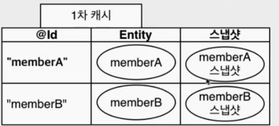

# 영속성 관리

## 영속성 컨텍스트

- “엔티티를 영구 저장하는 환경”이라는 의미
- 영속성 컨텍스트는 논리적인 개념이고, 엔티티 매니저를 통해서 영속성 컨텍스트에 접근한다.

### 엔티티의 생명주기

```java
// 객체를 생성하기만 함 (비영속)
Member member = new Member();
member.setId("member1");
member.setUsername("회원1");

EntityManager em = emf.createEntityManager();
em.getTransacetion().begin();

// 객체를 저장한 상태 (영속)
// EntityManager안에 있는 영속성 컨텍스트를 통해서 member과 관리되는 상태
// persist를 한다고 해서 바로 INSERT 쿼리가 날라가지는 않는다.
em.persist(member)

// member를 영속성 컨텍스트에서 분리, 준영속 상태가 된다.
em.detach(member)

// 객체를 삭제한 상태 (삭제)
em.remove(member)
```

- **비영속** (new/transient) : 영속성 컨텍스트와 전혀 관계가 없는 새로운 상태
- **영속** (managed) : 영속성 컨텍스트에 관리되는 상태
- **준영속** (detached) : 영속성 컨텍스트에 저장되었다가 분리된 상태
- **삭제** (removed) : 삭제된 상태

## 영속성 컨텍스트의 이점

```java
Member member = new Member();
member.setId("member1");
member.setUsername("회원1");

// 1차 캐시에 저장
em.persist(member);

// 1차 캐시에서 조회
Member findMember = em.find(Member.class, "member1");
// DB에서 조회
Member findMember2 = em.find(Member.class, "member2");
// 1차 캐시에서 조회
Member findMember3 = em.find(Member.class, "member2");

// 결과 True
// 동일성 보장
System.out.println(findMember2 == findMember3)

em.persist(memberA);
em.persist(memberB);
// 여기까지 INSERT 쿼리를 데이터베이스에 보내지 않는다.

Member memberA = em.find(Member.class, "member1");
// 영속 엔티티 데이터 수정
memberA.setUsername("hi");
memberA.setAge(10);

// Commit하는 순간 데이터베이스에 INSERT 및 UPDATE쿼리를 보낸다.
transaction.commit();
```

### 1차 캐시

- 1차 캐시를 영속성 컨텍스트라고 생각해도 됨
- em.find를 하면 바로 DB에서 조회하는 것이 아니라, 1차 캐시에서 먼저 조회를 한다.
- member2의 경우에는 1차 캐시에 없기 때문에 DB에서 조회를 하고, 1차 캐시에 저장한 다음에 findMember2에 반환한다.
- EntityManager는 하나의 트랜잭션 단위로 만들고, 트랜잭션이 종료되었을 때 사라지기 때문에 큰 성능 이점이 생기지는 않는다.

### 동일성 보장

- 1차 캐시로 반복 가능한 읽기등급의 트랜잭션 격리 수준을 DB가 아닌 애플리케이션 차원에서 제공

### 트랜잭션을 지원하는 쓰기 지연

- persist를 하는 동시에 DB에 쿼리를 보내는 것이 아니라, commit 하는 순간 쿼리를 보낸다.
- persis를 하면 1차캐시에 저장됨과 동시에 JPA가 엔티티를 분석해서 INSERT 쿼리를 생성한 후 `쓰기 지연 SQL 저장소`에 쿼리를 저장한다.

### 변경 감지 (더티체킹)



- JPA는 컬렉션을 다루듯 데이터를 다루는 것이 목표
- update 로직을 따로 태우지 않아도 setter를 통해 update를 할 수 있음
- Commit → flush 발생 → 엔티티와 스냅샷 비교 →  엔티티와 스냅샷이 다를 경우 UPDATE 쿼리를 쓰기 지연 SQL 저장소에 저장 → UPDATE 쿼리 전송
- 엔티티를 변경할 경우 persist를 따로 호출할 필요 없이 더티체킹만 해도 된다.

## 플러시

- 영속성 컨텍스트의 변경내용을 데이터베이스에 반영

### 플러시 발생

- DB 트랜잭션이 Commit되면 자동으로 플러시가 발생
- 변경 감지
- 수정된 엔티티 쓰기 지연 SQL 저장소에 등록
- 쓰기 지연 SQL 저장소의 쿼리를 데이터베이스에 전송

### 영속성 컨텍스트를 플러시 하는 방법

```java
Member member = new Member(200L, "member200");
em.persist(member);

em.flush(); // 강제로 플러시 호출
```

- em.flush() → 직접 호출
- 트랜잭션 커핏 → 플러시 자동 호출
- JPQL 쿼리 실행 → 플러시 자동 호출