# Spring - S3 연동

## AWS S3란 ?

<aside>
💡 Simple Storage Service의 약자로 파일 서버의 역할을 하는 서비스다. 일반적인 파일서버는 트래픽이 증가함에 따라서 장비를 증설하는 작업을 해야 하는데 S3는 이와 같은 것을 대행한다. 트래픽에 따른 시스템적인 문제는 걱정할 필요가 없어진다. 또 파일에 대한 접근 권한을 지정 할 수 있어서 서비스를 호스팅 용도로 사용하는 것을 방지 할 수 있다.

</aside>

※ 참고 : [https://dev.classmethod.jp/articles/for-beginner-s3-explanation/](https://dev.classmethod.jp/articles/for-beginner-s3-explanation/)

상품에 대한 이미지를 뿌릴 때 웹서버가 따로 하나 더 필요하다.

S3를 사용할 경우 AWS에 파일을 저장하고, URI를 통해 프론트 단으로 던져줄 수 있다.

S3 관련 용어 정리 : [https://daaa0555.tistory.com/471](https://daaa0555.tistory.com/471)

간단하게 정리하면 버킷은 하나의 저장소, 객체는 하나의 파일, 키는 파일에 접근하기 위한 고유 값이다.

S3에는 여러가지 종류? 형태의 클래스가 존재하지만, 일단 `Standard`로 진행한다.

## AWS IAM이란 ?

<aside>
💡 AWS Identity and Access Management(IAM)은 AWS 리소스에 대한 액세스를 안전하게 제어할 수 있는 웹 서비스입니다. IAM을 사용하여 리소스를 사용하도록 인증(로그인) 및 권한 부여(권한 있음)된 대상을 제어합니다.

</aside>

※ 참고 : [https://docs.aws.amazon.com/ko_kr/IAM/latest/UserGuide/introduction.html](https://docs.aws.amazon.com/ko_kr/IAM/latest/UserGuide/introduction.html)

※ 참고 : [https://choseongho93.tistory.com/263](https://choseongho93.tistory.com/263)

S3에 접근하는 사용자에 대한 접근 권한을 위해 IAM을 사용.

## AWS 설정

### S3 버킷 생성

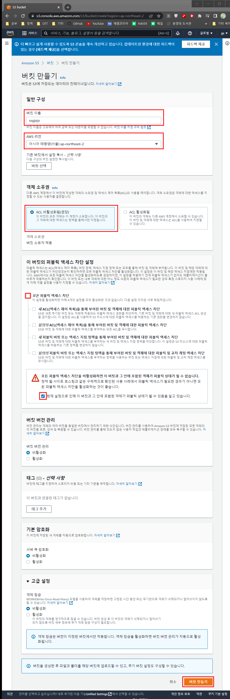
- 버킷 이름을 입력하고, 리전을 서울로 지정한다.
    - 우리가 서비스 할 지역이 한국이기 때문.
    - 타 리전으로 할 경우 통신 안정성, 가격 부분에서 이슈가 생길 수 있다.
- 우선 모든 퍼블릭 엑세스에 대하여 허용한다.

### 버킷 선택

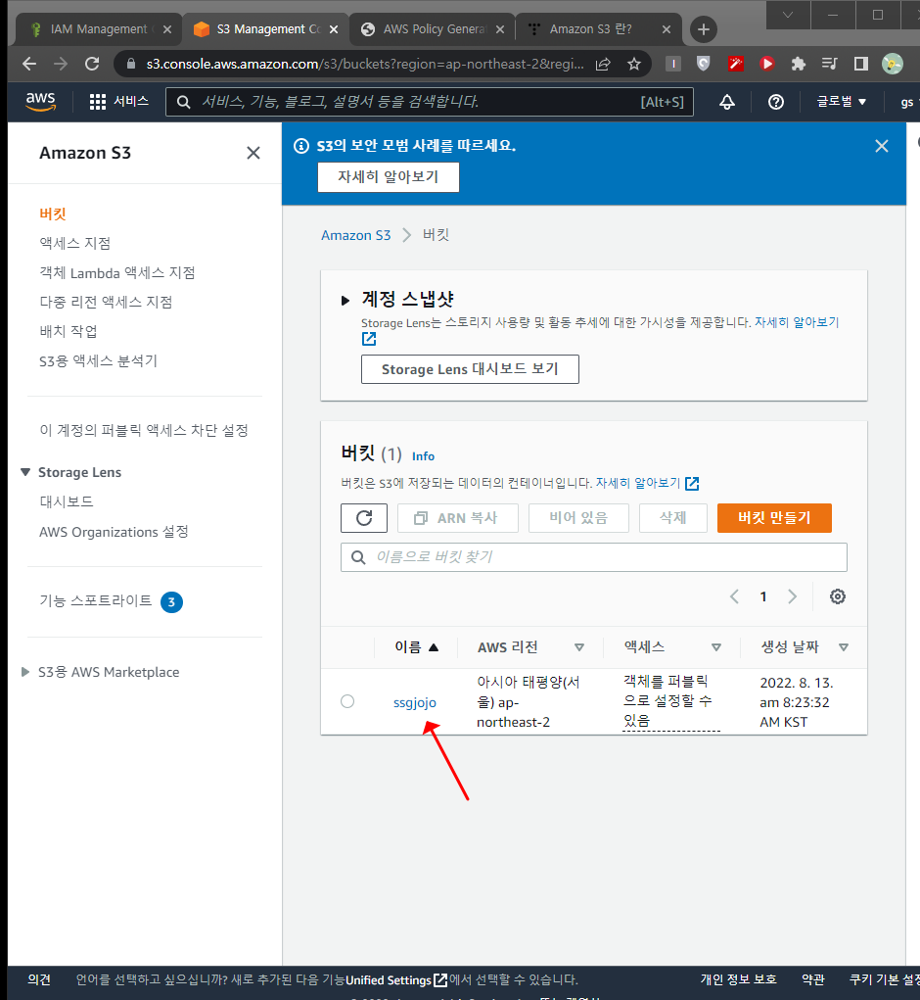
- 버킷 생성 후 보여지는 버킷 목록으로, 생성한 버킷으로 접속한다.

### 버킷 정책 생성

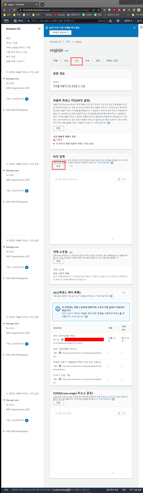
- 권한 탭을 선택하고, 버킷 정책 편집 버튼을 클릭한다.

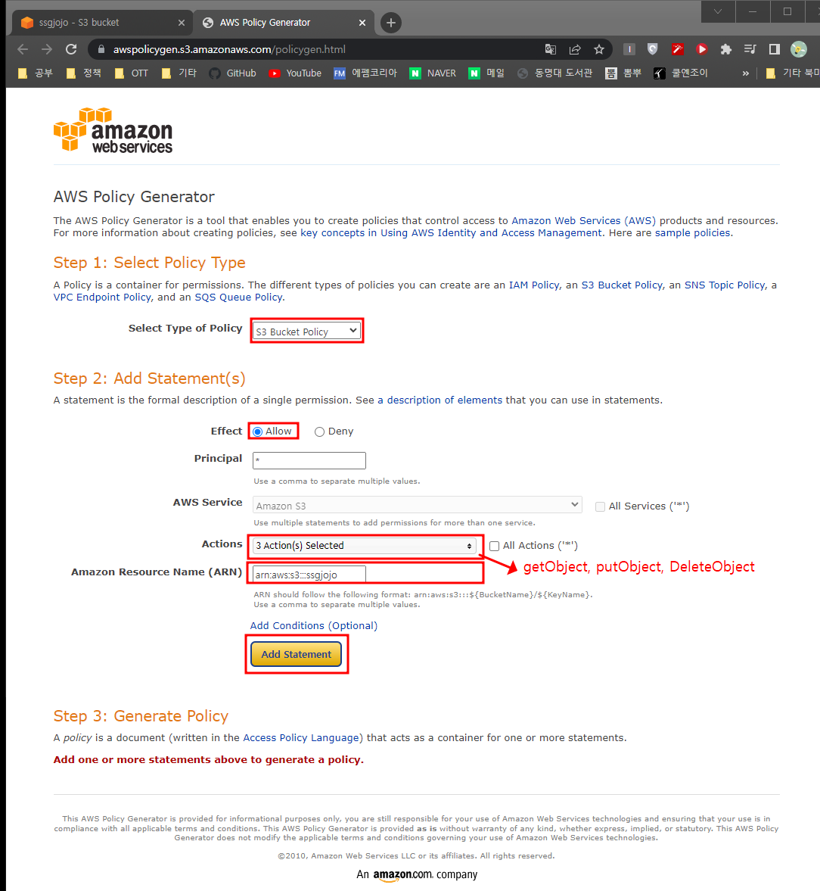

- 어떠한 서비스에 대한 정책인지 선택한다.
    - S3 Bucket으로 선택
- 정책 내용에 대한 설정을 한다.
    - 엑세스 허용에 대해 설정할 것이므로 `Allow` 로 설정한다.
    - 어떠한 행위들을 허용할 것인지 선택한다.
        - getObjcet
        - putObject
        - DeleteObject
    - 어떤 리소스에 대한 설정인지 입력한다.
        - 우리가 생성한 버킷의 리소스 이름을 작성한다.
- `Add Statement` 버튼을 클릭하여 정책을 추가한다.
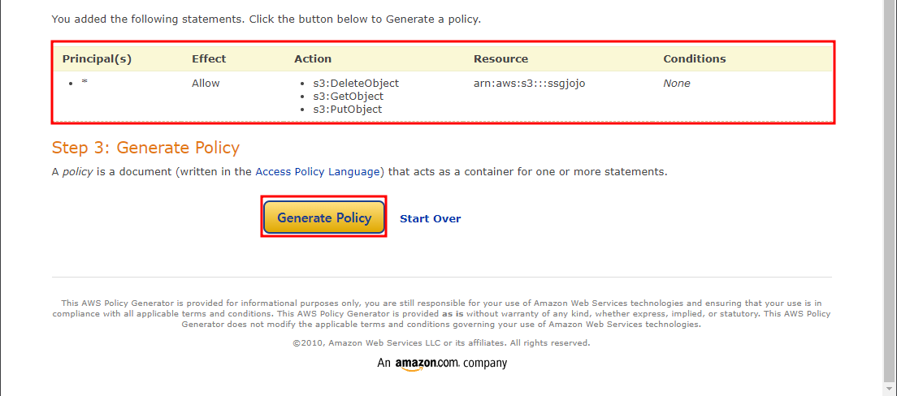

- 추가된 정책을 확인하고 `Generate Policy` 버튼을 클릭하여 Key-Value 형태로 주어지는 정책을 복사한다.

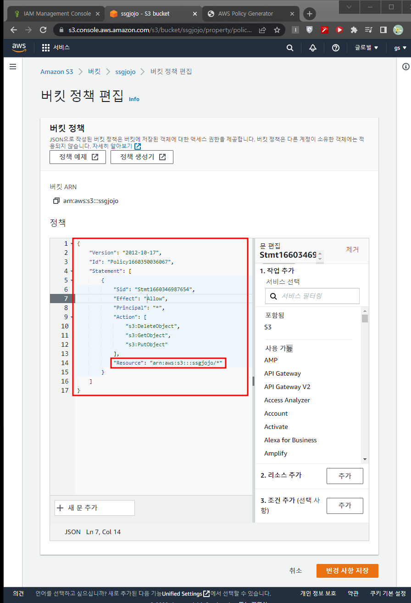
- 버킷의 권한 탭으로 돌아가 복사한 내용을 위 사진과 같이 붙여넣는다.
- 주의 !!!! GetObject, PutObject, DeleteObject 액션에 대한 정책이 추가되었을 경우 리소스에 `/*` 를 추가해주어야 한다.
    
    (참고 : [https://bobbyhadz.com/blog/aws-s3-action-does-not-apply-to-resources](https://bobbyhadz.com/blog/aws-s3-action-does-not-apply-to-resources) ) 
    
- `변경 사항 저장` 버튼을 클릭한다.

## IAM 설정

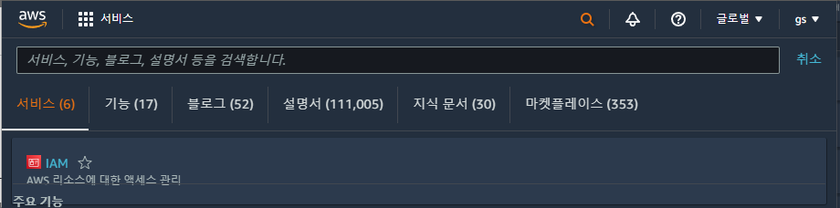
- `IAM` 을 검색하고, 리소스에 대한 액세스 관리 서비스를 선택한다.

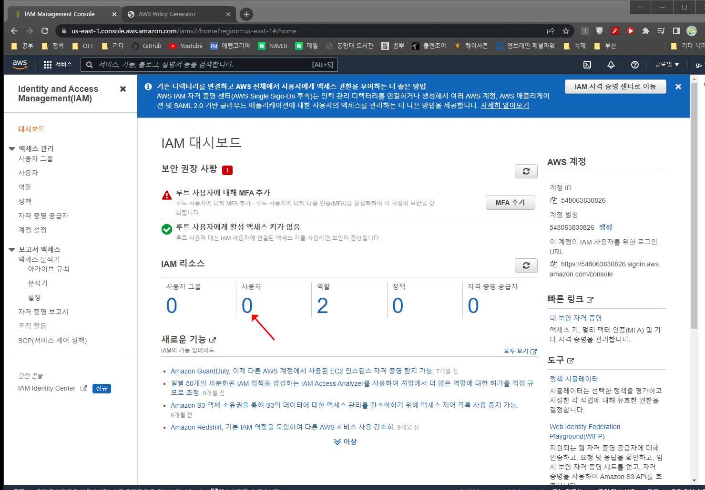
- 사용자 밑 숫자를 클릭한다.


- `사용자 추가` 버튼을 클릭한다.

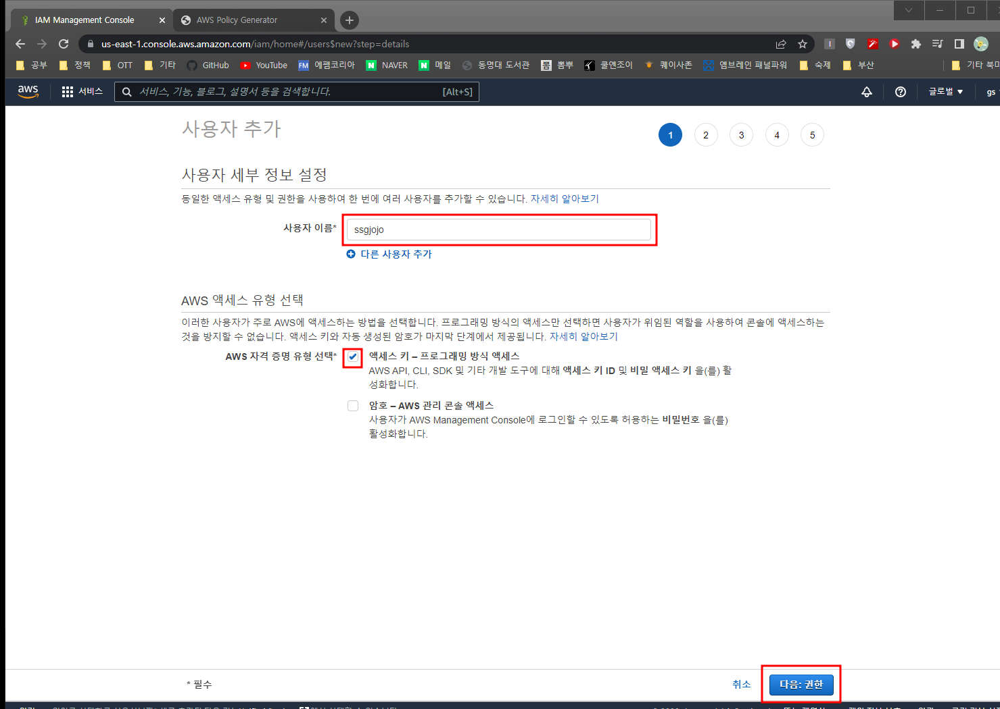
- 사용자 이름을 입력한다.
- 자격 증명 유형을 `액세스 키`로 선택한다.
- `다음:권한` 버튼을 클릭한다.

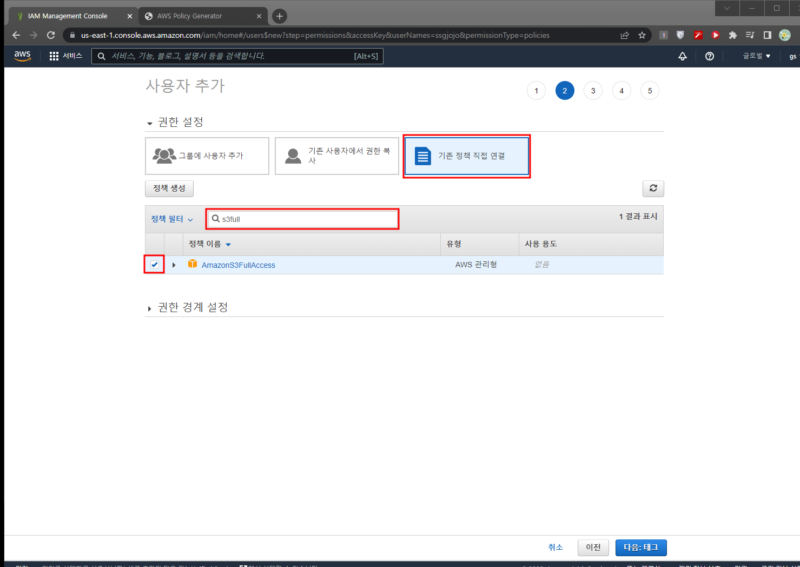
- `기존 정책 직접 연결` 을 클릭한다.
- 정책 필터에 s3full 을 입력하고 체크한다.
- `다음: 태그` 버튼을 클릭한다.
- 태그 추가는 생략하고 `다음: 검토` 버튼을 클릭한다.

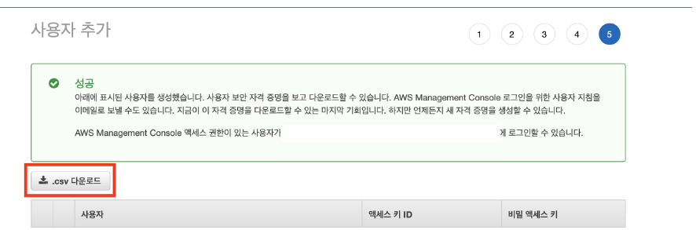
- 사용자가 만들어지면 `.csv 다운로드` 버튼을 클릭하여 username에 대한 access key를 획득한다.

## 스프링 설정

- 참고 블로그
    - [https://antdev.tistory.com/93](https://antdev.tistory.com/93)
    - [https://earth-95.tistory.com/117](https://earth-95.tistory.com/117)
- build.gradle
    
    ```
    dependencies {
        implementation 'org.springframework.cloud:spring-cloud-starter-aws:2.2.6.RELEASE'
    }
    ```
    
- 프로퍼티 작성 (둘 중에 자신에게 맞는 것으로 사용)
    - application.yml
        
        ```
        cloud:
          aws:
            s3:
              bucket: bucket-name을 작성해주세요
            credentials:
              access-key: accessKey를입력해주세요
              secret-key: secretKey를입력해주세요
            region:
              static: ap-northeast-2
              auto: false
            stack:
              auto: false
        ```
        
    - application.properties
        
        ```
        # S3 Bucket
        # cloud.aws.stack.auto 속성을 지정하지 않으면 StackTrace가 발생할 수 있음.
        # properties 파일에서 설정하던지, @SpringBootApplication 클래스에서 설정하던지
        cloud.aws.credentials.accessKey=accessKey를입력해주세요
        cloud.aws.credentials.secretKey=secretKey를입력해주세요
        cloud.aws.stack.auto=false
        
        # AWS S3 Service bucket
        cloud.aws.s3.bucket=bucket-name을 작성해주세요
        cloud.aws.region.static=ap-northeast-2
        
        # multipart 사이즈 설정
        spring.http.multipart.max-file-size=1024MB
        spring.http.multipart.max-request-size=1024MB
        
        # EC2를 사용하는 것이 아니기 때문에 EC2에 대한 에러는 띄우지 않도록 설정.
        logging.level.com.amazonaws.util.EC2MetadataUtils=error
        logging.level.com.amazonaws.internal.InstanceMetadataServiceResourceFetcher=error
        ```
        
- Config 파일 생성
    
    ```java
    package com.cloneproject.ssgjojo.config;
    
    import com.amazonaws.auth.AWSStaticCredentialsProvider;
    import com.amazonaws.auth.BasicAWSCredentials;
    import com.amazonaws.services.s3.AmazonS3;
    import com.amazonaws.services.s3.AmazonS3Client;
    import com.amazonaws.services.s3.AmazonS3ClientBuilder;
    import org.springframework.beans.factory.annotation.Value;
    import org.springframework.context.annotation.Bean;
    import org.springframework.context.annotation.Configuration;
    import org.springframework.context.annotation.Primary;
    
    @Configuration
    public class AWSS3Config {
        // properties accessKey 값 주입
        @Value("${cloud.aws.credentials.accessKey}")
        private String accessKey;
    
        // properties secretKey 주입
        @Value("${cloud.aws.credentials.secret-key}")
        private String secretKey;
    
        // properties region 주입
        @Value("${cloud.aws.region.static}")
        private String region;
    
        // aws 자격증명 생성
        @Bean
        @Primary
        public BasicAWSCredentials awsCredentialsProvider(){
            BasicAWSCredentials basicAWSCredentials = new BasicAWSCredentials(accessKey, secretKey);
            return basicAWSCredentials;
        }
    
        // S3 객체 생성
        @Bean
        public AmazonS3 amazonS3() {
            AmazonS3 s3Builder = AmazonS3ClientBuilder.standard()
                    .withRegion(region)
                    .withCredentials(new AWSStaticCredentialsProvider(awsCredentialsProvider()))
                    .build();
            return s3Builder;
        }
    }
    ```
    
- Controller
    
    ```java
    package com.cloneproject.ssgjojo.util.s3;
    
    import lombok.RequiredArgsConstructor;
    import org.springframework.web.bind.annotation.PostMapping;
    import org.springframework.web.bind.annotation.RequestMapping;
    import org.springframework.web.bind.annotation.RestController;
    import org.springframework.web.multipart.MultipartFile;
    import org.springframework.web.bind.annotation.*;
    
    import java.util.List;
    
    @RestController
    @RequestMapping("/api")
    @RequiredArgsConstructor
    public class AwsS3Controller {
        private final AwsS3Service awsS3Service;
    
        @PostMapping("/resource")
        public List<FileInfoDto> upload(@RequestParam("file1")List<MultipartFile> file) {
            return awsS3Service.upload(file);
        }
    }
    ```
    
- Service
    
    ```java
    package com.cloneproject.ssgjojo.util.s3;
    
    import lombok.RequiredArgsConstructor;
    import org.springframework.stereotype.Service;
    import org.springframework.beans.factory.annotation.Value;
    import org.springframework.web.multipart.MultipartFile;
    
    import java.util.ArrayList;
    import java.util.List;
    
    @Service
    @RequiredArgsConstructor
    public class AwsS3Service {
        private final AwsS3ResourceStorage awsS3ResourceStorage;
    
        @Value("${cloud.aws.s3.bucket}")
        private String bucket;
    
        public List<FileInfoDto> upload(List<MultipartFile> file) {
            List<FileInfoDto> returnDto = new ArrayList<>();
    
            for(MultipartFile temp : file) {
                FileInfoDto fileInfoDto = FileInfoDto.multipartOf(temp);
                awsS3ResourceStorage.store(fileInfoDto, temp);
                returnDto.add(fileInfoDto);
            }
    
            return returnDto;
        }
    }
    ```
    
- FileInfoDto
    
    ```java
    package com.cloneproject.ssgjojo.util.s3;
    
    import com.cloneproject.ssgjojo.util.MultipartUtil;
    import lombok.*;
    import org.springframework.web.multipart.MultipartFile;
    
    import java.time.LocalDateTime;
    
    @Getter
    @Setter
    @ToString
    @Builder
    @NoArgsConstructor
    @AllArgsConstructor
    public class FileInfoDto {
        private String id;
        private String name;
        private String format;
        private String localPath;
        private String remotePath;
        private long bytes;
    
        @Builder.Default
        private LocalDateTime createTime = LocalDateTime.now();
    
        public static FileInfoDto multipartOf(MultipartFile multipartFile) {
            final String fileId = MultipartUtil.createFileUUID();
            final String format = MultipartUtil.getFormat(multipartFile.getContentType());
    
            return FileInfoDto.builder()
                    .id(fileId)
                    .name(multipartFile.getOriginalFilename())
                    .format(format)
                    .localPath(MultipartUtil.createLocalPath(fileId, format))
                    .bytes(multipartFile.getSize())
                    .build();
        }
    }
    ```
    
- Storage
    
    ```java
    package com.cloneproject.ssgjojo.util.s3;
    
    import com.amazonaws.services.s3.AmazonS3;
    import lombok.RequiredArgsConstructor;
    import org.springframework.beans.factory.annotation.Value;
    import org.springframework.stereotype.Component;
    import org.springframework.web.multipart.MultipartFile;
    
    import java.io.File;
    
    @Component
    @RequiredArgsConstructor
    public class AwsS3ResourceStorage {
        @Value("${cloud.aws.s3.bucket}")
        private String bucket;
        private final AmazonS3 amazonS3;
    
        public void store(FileInfoDto fileInfoDto, MultipartFile multipartFile) {
            File file = new File(fileInfoDto.getLocalPath());
    
            try {
                multipartFile.transferTo(file);
    
                amazonS3.putObject(bucket, fileInfoDto.getRemotePath(), file);
            } catch (Exception e) {
                throw new RuntimeException(e);
            }
            finally {
                if(file.exists())
                    file.delete();
            }
        }
    }
    ```
