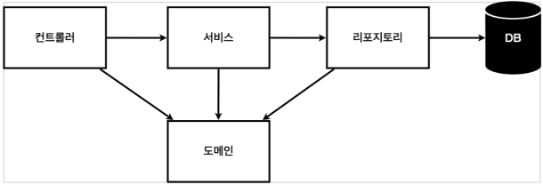

# 3. 회원 관리 예제

## 비즈니스 요구사항 정리

- 데이터 : 회원 ID, 이름
- 기능 : 회원 등록, 조회
- 아직 데이터 저장소가 선정되지 않음

## 애플리케이션 구조



- 컨트롤러 : 웹 MVC의 컨트롤러 역할
- 서비스 : 핵심 비즈니스 로직 구현
- 리포지토리 : 데이터베이스에 접근, 도메인 객체를 DB에 저장하고 관리
- 도메인 : 비즈니스 도메인 객체 예) 회원, 주문, 쿠폰 등등 …

## 클래스 의존관계


- 아직 데이터 저장소가 선정되지 않아서 우선 인터페이스로 구현 클래스를 변경할 수 있도록 설계
- 데이터 저장소는 RDB, NoSQL 등등 다양한 저장소를 고민중인 상황
- 개발을 진행하기 위해서는 초기 개발 단계에서는 구현체로 가벼운 메모리 기반의 데이터 저장소 사용

## 구현

### 도메인

```java
package hello.hellospring.domain;

public class Member {
    /*
     * id : 식별자, 임의의 값 (시퀀스)
     * name : 이름
     */
    private Long id;
    private String name;

    public Long getId() {
        return id;
    }

    public void setId(Long id) {
        this.id = id;
    }

    public String getName() {
        return name;
    }

    public void setName(String name) {
        this.name = name;
    }
}
```

### Repository

- repository 인터페이스
    
    ```java
    package hello.hellospring.repository;
    
    import hello.hellospring.domain.Member;
    
    import java.util.List;
    import java.util.Optional;
    
    public interface MemberRepository {
        /*
         * save : 회원 저장
         * findById : 아이디로 회원 검색
         * findByName : 이름으로 회원 검색
         * findAll : 모든 회원 리스트 반환
         * Optional -> 반환이 Null일 수 있을 때 사용하는 것.
         */
        Member save(Member member);
        Optional<Member> findById(Long id);
        Optional<Member> findByName(String name);
        List<Member> findAll();
    }
    ```
    
- repository 구현체
    
    ```java
    package hello.hellospring.repository;
    
    import hello.hellospring.domain.Member;
    
    import java.util.*;
    
    public class MemoryMemberRepository implements MemberRepository{
    
        /*
         * Hashmap => 실무에서는 동시성 문제로 인해 공유되는 변수일 경우 concurrenthashmap를 사용한다.
         * long => 실무에서는 동시성 문제로 인해 공유되는 변수일 경우 어텀(?) Long을 사용한다.
         */
        private static Map<Long, Member> store = new HashMap<>();
        private static long sequence = 0L;
    
        @Override
        public Member save(Member member) {
            member.setId(++sequence);
            store.put(member.getId(), member);
            return member;
        }
    
        @Override
        public Optional<Member> findById(Long id) {
            return Optional.ofNullable(store.get(id));
        }
    
        @Override
        public Optional<Member> findByName(String name) {
            // 람다식 사용
            return store.values().stream()
                    .filter(member -> member.getName().equals(name))
                    .findAny();
        }
    
        @Override
        public List<Member> findAll() {
            return new ArrayList<>(store.values());
        }
    
        public void clearStore() {
            store.clear();
        }
    }
    ```
    

### 구현체 테스트케이스

- 개발한 기능을 테스트 할 때 자바의 main 메서드를 통해서 실행하거나, 웹 애플리케이션의 컨트롤러를 통해서 해당 기능을 실행한다.
    - 이러한 방법은 준비하고 실행하는데 오래 걸린다.
    - 반복 실행하기 어렵고 여러 테스트를 한 번에 실행하기 어렵다.
- Given - When - Then 형태로 테스트 코드를 짜면 좋다
    - Given : 무언가가 주어졌을 때
    - When : 이것을 실행했을 때
    - Then : 이러한 결과가 나와야 해.
- JUnit이라는 프레임워크로 테스트를 한다면 자동화가 가능하다.
- @Test 어노테이션을 통해 테스트 메소드임을 선언한다
- 실무에서는 테스트 코드에서 오류가 발생하면 다음 단계로 넘어가지 못하도록 막는다.
- 모든 테스트는 순서와 상관 없이 모든 함수가 따로 테스트 되도록 설계되어야 한다.
- `@AfterEach` 어노테이션을 통해 메소드 들이 끝날 때마다 호출되는 메소드를 선언해서 저장소들을 계속 비워서 테스트 간의 간섭을 없앤다.
- 테스트 코드를 만들고 구현 클래스를 만드는 방식을 `TDD` 방식이라고 한다.
- 테스트 코드가 많아지면 패키지 단위로 테스트 코드를 실행해주는 기능이 있다.

### 테스트 코드

```java
    @Test
    public void save() {
        Member member = new Member();
        member.setName("spring");

        repository.save(member);

        Member result = repository.findById(member.getId()).get();

        // 가장 간단함. 그러나 매번 이런식으로 할 수는 없음.
        //System.out.println("result = " + (result == member));
        // Junit 활용
        //Assertions.assertEquals(result, member);
        // assertj 활용
        assertThat(member).isEqualTo(result);
    }
```

### 서비스 구현

- 코드
    
    ```java
    package hello.hellospring.service;
    
    import hello.hellospring.domain.Member;
    import hello.hellospring.repository.MemberRepository;
    
    import java.util.List;
    import java.util.Optional;
    
    public class MemberService {
    
        private final MemberRepository memberRepository;
    
        // repo를 직접 지정하는 것이 아니라 외부에서 넣어줌.
        // 디펜던시 인젝션 DI 라고 부름
        public MemberService(MemberRepository memberRepository) {
            this.memberRepository = memberRepository;
        }
    
        /*
         * 회원가입
         */
    
        public Long join(Member member) {
    
            // 중복회원 검색
            validatedDuplicateMember(member);
    
            memberRepository.save(member);
            // 만들어진 객체의 Id를 반환
            return member.getId();
        }
    
        /*
         * 전체 회원 조회
         */
        public List<Member> findMembers() {
            return memberRepository.findAll();
        }
    
        public Optional<Member> findOne(Long memberId) {
            return memberRepository.findById(memberId);
        }
    
        private void validatedDuplicateMember(Member member) {
            memberRepository.findByName(member.getName())
                    .ifPresent(m -> {
                        throw new IllegalStateException("이미 존재하는 회원입니다.");
                    });
        }
    }
    ```