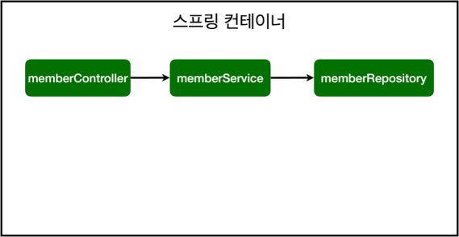

# 4. 스프링 빈과 의존관계



## 스프링 빈을 등록하고, 의존관계 설정하기

- 컨트롤러가 서비스를 통해서 데이터를 추가하고 조회할 수 있도록 설계하는 것을 `의존 관계를 설정한다` 라고 부른다.
- @Controller 어노테이션을 설정하면 스프링 컨테이너에 컨트롤러 객체를 생성해서 넣어둔 후 컨테이너가 관리한다.
    - 스프링 빈이 관리된다 라고 표현을 한다.
- @Service 어노테이션을 설정하면 스프링 컨테이너에 서비스 객체를 생성해서 넣어둔 후 컨테이너가 관리한다.
- 간략한 정리
    - 컨트롤러를 통해서 외부 요청을 받는다.
    - 서비스에서 비즈니스 로직을 실행한다.
    - 리포지토리에서 데이터 저장을 한다.

### 참고!! 스프링 컨테이너에 스프링 빈을 등록할 때 싱글톤으로 등록한다.

- 같은 스프링 빈이면 모두 같은 인스턴스이다.
- 싱글톤이 아니게 설정할 수 있지만, 특별한 경우를 제외하면 대부분 싱글톤을 사용한다.

## 스프링 빈을 등록하는 2가지 방법

- **컴포넌트 스캔과 자동 의존 관계 설정**
    - Component 어노테이션을 하나씩 하나씩 지정하는 방법
    - 우리가 컨트롤러, 서비스, 리포지토리에 설정한 어노테이션들은 Component 어노테이션의 한 형태이다.
    - Component 어노테이션을 선언한다고 해서 모두 스프링 빈으로 등록되는 것은 아니다.
        - `SpringBootApplication` 어노테이션이 있는 패키지의 하위 패키지의 클래스에서만 자동으로 등록이 된다.
        - 하위 패키지가 아니더라도 등록하게 할 수는 있지만, 기본적으로는 하위패키지만 자동으로 등록이 된다.
    - 
- **자바 코드로 직접 스프링 빈 등록하기**
    - @Service, @Repository, @Autowired 어노테이션을 모두 제거하고 진행한다.
    - @Configuration 어노테이션을 선언한 클래스를 생성하고 @Bean 어노테이션을 선언하여 클래스를 만든다.
        
        ```java
        package hello.hellospring;
        
        import hello.hellospring.repository.MemberRepository;
        import hello.hellospring.repository.MemoryMemberRepository;
        import hello.hellospring.service.MemberService;
        import org.springframework.context.annotation.Bean;
        import org.springframework.context.annotation.Configuration;
        
        @Configuration
        public class SpringConfig {
        
            @Bean
            public MemberService memberService() {
                return new MemberService(memberRepository());
            }
        
            @Bean
            public MemberRepository memberRepository() {
                return new MemoryMemberRepository();
            }
        }
        ```
        
    - @Controller는 스프링 컨테이너에 올라가야 하기 때문에 기존과 동일하게 선언하고, Autowired로 서비스를 땡겨온다.
    
    ### 참고!!
    
    - 이전에는 @Configuration 클래스를 자바코드가 아닌 XML형태로 설정했었다.
    - DI에는 필드 주입, Setter 주입, 생성자 주입 이렇게 3가지 방법이 있다.
    - 의존관계가 실행중에 동적으로 변하는 경우 거의 없으므로 생성자 주입을 권장한다.
    - 실무에서는 주로 정형화된 컨트롤러, 서비스, 리포지토리 같은 코드는 컴포넌트 스캔을 사용한다.
    - 코드로 직접 등록할 경우 정형화되지 않거나, 상황에 따라 구현 클래스를 변경해야 하면 `설정을 통해 스프링 빈으로 등록한다.`
        
        → 예) Data 저장소가 정해지지 않아 인터페이스를 통해 구현 클래스를 만들었고, 만약에 구현 클래스를 변경할 경우가 이에 해당한다.
    
        → 기존의 소스코드는 하나도 건드리지 않고 할 수 있다. 
