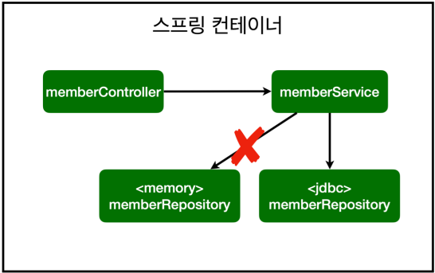

# 6. 스프링 DB 접근 기술

## H2 데이터베이스 설치

링크 : [https://h2database.com/h2-setup-2019-10-14.exe](https://h2database.com/h2-setup-2019-10-14.exe)

## 스프링 통합 테스트

- 코드
    
    ```java
    package hello.hellospring.service;
    
    import hello.hellospring.domain.Member;
    import hello.hellospring.repository.MemberRepository;
    import org.assertj.core.api.Assertions;
    import org.junit.jupiter.api.Test;
    import org.springframework.beans.factory.annotation.Autowired;
    import org.springframework.boot.test.context.SpringBootTest;
    import org.springframework.transaction.annotation.Transactional;
    
    import static org.junit.jupiter.api.Assertions.assertThrows;
    
    @SpringBootTest
    @Transactional
    public class MemberServiceIntegrationTest {
    
        @Autowired MemberService memberService;
        @Autowired MemberRepository memberRepository;
    
        @Test
        void 회원가입()  {
            //given
            Member member = new Member();
            member.setName("spring");
    
            //when
            Long saveId = memberService.join(member);
    
            //then
            Member findMember = memberService.findOne(saveId).get();
            Assertions.assertThat(member.getName()).isEqualTo(findMember.getName());
        }
    
        @Test
        public void 중복_회원_예외() {
            //given
            Member member1 = new Member();
            member1.setName("spring");
    
            Member member2 = new Member();
            member2.setName("spring");
    
            //when
            memberService.join(member1);
    
            IllegalStateException e = assertThrows(IllegalStateException.class, () -> memberService.join(member2));
    
            Assertions.assertThat(e.getMessage()).isEqualTo("이미 존재하는 회원입니다.");
        }
    }
    ```
    
- 디비 테스트할 때 `Transactional` 어노테이션을 통해  `Auto Commit` 되는 것을 방지할 수 있다.
- 디비 연결까지하는 통합테스트가 좋은 테스트는 아니다.
- 순수한 단위 별로의 단위 테스트가 좋은 테스트일 확률이 높다.
- 스프링 컨테이너 없이 테스트할 수 있도록 연습해야 한다.
- 스프링 컨테이너까지 올리게된다면 잘못 설계된 테스트일 확률이 상당히 높다.

## JDBC를 활용한 접근

- H2, JDBC 관련 라이브러리 추가
    - `build.gradle`에 아래 내용 추가
        
        ```java
        implementation 'org.springframework.boot:spring-boot-starter-jdbc'
        runtimeOnly 'com.h2database:h2'
        ```
        
- 스프링 부트 데이터베이스 연결 설정 추가
    - `resources/application.properties`에 아래 내용 추가
        
        ```java
        spring.datasource.url=jdbc:h2:tcp://localhost/~/test
        spring.datasource.driver-class-name=org.h2.Driver
        spring.datasource.username=sa
        ```
        
- Repository 구현
    - 코드
        
        ```java
        package hello.hellospring.repository;
        
        import hello.hellospring.domain.Member;
        import org.springframework.jdbc.datasource.DataSourceUtils;
        import javax.sql.DataSource;
        import java.sql.*;
        import java.util.ArrayList;
        import java.util.List;
        import java.util.Optional;
        
        public class JdbcMemberRepository implements MemberRepository {
            private final DataSource dataSource;
        
            public JdbcMemberRepository(DataSource dataSource) {
                this.dataSource = dataSource;
            }
        
            @Override
            public Member save(Member member) {
                // 쿼리 생성
                String sql = "insert into member(name) values(?)";
        
                Connection conn = null;
                PreparedStatement pstmt = null;
                // 결과를 받는 객체
                ResultSet rs = null;
        
                // 예외처리에 대한 내용은 최근 사용되고 있는 다른 문법이 있음.
                // 실제로 사용할 코드가 아니기 때문에 try-catch문으로 작성
                try {
                    // 커넥션 획득
                    conn = getConnection();
                    // RETURN_GENERATED_KEYS : 쿼리의 실행 결과로 AI가 되는 컬럼의 값을 획득할 수 있도록 설정
                    pstmt = conn.prepareStatement(sql,
                            Statement.RETURN_GENERATED_KEYS);
                    
                    // 쿼리에 데이터를 매핑
                    pstmt.setString(1, member.getName());
                    
                    // 디비에 쿼리 전송
                    pstmt.executeUpdate();
        
                    // AI가 되는 컬럼의 값을 획득 함.
                    rs = pstmt.getGeneratedKeys();
        
                    // ResultSet에서 다음 객체를 선택
                    if (rs.next()) {
                        member.setId(rs.getLong(1));
                    } else {
                        throw new SQLException("id 조회 실패");
                    }
                    
                    return member;
                } catch (Exception e) {
                    throw new IllegalStateException(e);
                } finally {
                    // Connection 객체 해제하는 메소드 호출
                    close(conn, pstmt, rs);
                }
            }
        
            @Override
            public Optional<Member> findById(Long id) {
                String sql = "select * from member where id = ?";
                
                Connection conn = null;
                PreparedStatement pstmt = null;
                ResultSet rs = null;
                
                try {
                    conn = getConnection();
                    pstmt = conn.prepareStatement(sql);
                    pstmt.setLong(1, id);
                    
                    
                    // 쿼리 실행
                    rs = pstmt.executeQuery();
                    
                    // 결과 출력
                    if(rs.next()) {
                        Member member = new Member();
                        member.setId(rs.getLong("id"));
                        member.setName(rs.getString("name"));
                        return Optional.of(member);
                    } else {
                        return Optional.empty();
                    }
                } catch (Exception e) {
                    throw new IllegalStateException(e);
                } finally {
                    close(conn, pstmt, rs);
                }
            }
        
            @Override
            public List<Member> findAll() {
                String sql = "select * from member";
        
                Connection conn = null;
                PreparedStatement pstmt = null;
                ResultSet rs = null;
        
                try {
                    conn = getConnection();
                    pstmt = conn.prepareStatement(sql);
                    rs = pstmt.executeQuery();
                    List<Member> members = new ArrayList<>();
        
                    while(rs.next()) {
                        Member member = new Member();
                        member.setId(rs.getLong("id"));
                        member.setName(rs.getString("name"));
                        members.add(member);
                    }
        
                    return members;
                } catch (Exception e) {
                    throw new IllegalStateException(e);
                } finally {
                    close(conn, pstmt, rs);
                }
            }
        
            @Override
            public Optional<Member> findByName(String name) {
                String sql = "select * from member where name = ?";
        
                Connection conn = null;
                PreparedStatement pstmt = null;
                ResultSet rs = null;
        
                try {
                    conn = getConnection();
                    pstmt = conn.prepareStatement(sql);
                    pstmt.setString(1, name);
                    rs = pstmt.executeQuery();
        
                    if(rs.next()) {
                        Member member = new Member();
                        member.setId(rs.getLong("id"));
                        member.setName(rs.getString("name"));
        
                        return Optional.of(member);
                    }
                    return Optional.empty();
                } catch (Exception e) {
                    throw new IllegalStateException(e);
                } finally {
                    close(conn, pstmt, rs);
                }
            }
        
            private Connection getConnection() {
                // DataSourceUtils를 통해서 커넥션을 획득해야한다.
                return DataSourceUtils.getConnection(dataSource);
            }
        
            private void close(Connection conn, PreparedStatement pstmt, ResultSet rs)
            {
                try {
                    if (rs != null) {
                        rs.close();
                    }
                } catch (SQLException e) {
                    e.printStackTrace();
                }
                try {
                    if (pstmt != null) {
                        pstmt.close();
                    }
                } catch (SQLException e) {
                    e.printStackTrace();
                }
                try {
                    if (conn != null) {
                        close(conn);
                    }
                } catch (SQLException e) {
                    e.printStackTrace();
                }
            }
        
            private void close(Connection conn) throws SQLException {
                DataSourceUtils.releaseConnection(conn, dataSource);
            }
        }
        ```
        
- SpringConfig 수정
    - 코드
        
        ```java
        package hello.hellospring;
        
        import hello.hellospring.repository.JdbcMemberRepository;
        import hello.hellospring.repository.MemberRepository;
        import hello.hellospring.repository.MemoryMemberRepository;
        import hello.hellospring.service.MemberService;
        import org.springframework.beans.factory.annotation.Autowired;
        import org.springframework.context.annotation.Bean;
        import org.springframework.context.annotation.Configuration;
        
        import javax.sql.DataSource;
        
        @Configuration
        public class SpringConfig {
        
            DataSource dataSource;
        
            @Autowired
            public SpringConfig(DataSource dataSource) {
                this.dataSource = dataSource;
            }
        
            @Autowired
        
            @Bean
            public MemberService memberService() {
                return new MemberService(memberRepository());
            }
        
            @Bean
            public MemberRepository memberRepository() {
                // return new MemoryMemberRepository();
                return new JdbcMemberRepository(dataSource);
            }
        }
        ```
        
    - 멤버에 대한 repository를 MemoryMemberRepository 객체가 아닌 JdbcMemberRepository 객체로 변경함.
    - 스프링의 DI으로 인해 손쉽게 가능하다.



## 스프링 JdbcTemplate

- MyBatis 같은 라이브러리고, 반복 코드를 제거하는데 도움을 준다.
- 코드
    
    ```
    package hello.hellospring.repository;
    
    import hello.hellospring.domain.Member;
    import org.springframework.beans.factory.annotation.Autowired;
    import org.springframework.jdbc.core.JdbcTemplate;
    import org.springframework.jdbc.core.RowMapper;
    import org.springframework.jdbc.core.namedparam.MapSqlParameterSource;
    import org.springframework.jdbc.core.simple.SimpleJdbcInsert;
    
    import javax.sql.DataSource;
    import java.util.HashMap;
    import java.util.List;
    import java.util.Map;
    import java.util.Optional;
    
    public class JdbcTemplateMemberRepository implements MemberRepository{
    
        private final JdbcTemplate jdbcTemplate;
    
        // 생성자가 하나일 때는 Autowired를 생략할 수 있다.
        @Autowired
        public JdbcTemplateMemberRepository(DataSource dataSource) {
            jdbcTemplate = new JdbcTemplate(dataSource);
        }
    
        @Override
        public Member save(Member member) {
            SimpleJdbcInsert jdbcInsert = new SimpleJdbcInsert(jdbcTemplate);
            // 테이블 이름과 PK 컬럼 설정
            jdbcInsert.withTableName("member").usingGeneratedKeyColumns("id");
    
            Map<String, Object> parameters = new HashMap<>();
            parameters.put("name", member.getName());
    
            // 쿼리 실행 후 생성된 데이터의 PK를 받고 이를 멤버에 설정
            Number key = jdbcInsert.executeAndReturnKey(new MapSqlParameterSource(parameters));
            member.setId(key.longValue());
            return member;
        }
    
        @Override
        public Optional<Member> findById(Long id) {
            List<Member> result = jdbcTemplate.query("select * from member where id = ?", memberRowMapper(), id);
            return result.stream().findAny();
        }
    
        @Override
        public Optional<Member> findByName(String name) {
            List<Member> result = jdbcTemplate.query("select * from member where name = ?", memberRowMapper(), name);
            return result.stream().findAny();
        }
    
        @Override
        public List<Member> findAll() {
            return jdbcTemplate.query("select * from member", memberRowMapper());
        }
    
        private RowMapper<Member> memberRowMapper() {
            return (rs, rowNum) -> {
                Member member = new Member();
                member.setId(rs.getLong("id"));
                member.setName(rs.getString("name"));
                return member;
            };
        }
    }
    
    ```
    

## JPA

- JPA = 객체 + ORM (Object, Relational, Mapping)
- 기본의 반복 코드는 물론이고, 기본적인 SQL도 JPA가 직접 만들어서 실행해준다.
- 객체 중심의 설계로 패러다임을 전환할 수 있다.
- 개발 생산성이 크게 높아진다.
- `build.gradle`에 아래 내용 추가
    
    implementation 'org.springframework.boot:spring-boot-starter-data-jpa’
    
- `application.properties`에 아래 내용 추가
    
    ```java
    // 실행되는 SQL을 출력
    spring.jpa.show-sql=true
    // DDL이 자동으로 실행되지 않도록 설정
    spring.jpa.hibernate.ddl-auto=none
    ```
    
- 도메인 클래스에 Entity 어노테이션을 추가해야한다.
- @Id 어노테이션을 통해 PK를 지정해준다.
- @GeneratedValue 어노테이션을 통해 AI 에 대해 설정할 수 있다.
- @Column 어노테이션을 통해 데이터베이스 상의 컬럼과 이름을 맞출 수 있다.
- repository 클래스에 EntityManager 객체를 생성해야한다.
- JPA는 EntityManager를 통해 모든 동작이 이루어진다.
- `'org.springframework.boot:spring-boot-starter-data-jpa'` 라이브러리를 사용하면 SpringBoot가 알아서 EntityManager를 자동으로 생성한다.
- JpaRepository는 EntityManager객체를 만들고 DI 해야한다.
- 코드
    
    ```java
    package hello.hellospring.repository;
    
    import hello.hellospring.domain.Member;
    
    import javax.persistence.EntityManager;
    import java.util.List;
    import java.util.Optional;
    
    public class JpaMemberRepository implements MemberRepository{
    
        private final EntityManager em;
    
        // DI
        public JpaMemberRepository(EntityManager em) {
            this.em = em;
        }
    
        @Override
        public Member save(Member member) {
            // INSERT ...
            em.persist(member);
            return member;
        }
    
        @Override
        public Optional<Member> findById(Long id) {
            Member member =  em.find(Member.class, id);
            return Optional.ofNullable(member);
        }
    
        @Override
        public Optional<Member> findByName(String name) {
            List<Member> result = em.createQuery("select m from Member m where m.name= :name", Member.class)
                    .setParameter("name", name)
                    .getResultList();
    
            return result.stream().findAny();
        }
    
        @Override
        public List<Member> findAll() {
            return em.createQuery("select m from Member m", Member.class)
                    .getResultList();
        }
    }
    ```
    

## 스프링 데이터 JPA

- 스프링 데이터 JPA를 사용하면 인터페이스 만으로 개발을 완료할 수 있다.
- 반복 개발해온 CRUD 기능도 스프링 데이터 JPA가 모두 제공함
- 스프링 데이터 JPA는 JPA를 편리하게 사용하도록 도와주는 기술이므로, JPA를 공부한 후 스프링 데이터 JPA를 배워야 한다.
- JpaRepository를 상속하면 알아서 인터페이스에 대한 구현체를 만들고 자동으로 스프링 빈에 등록한다
- Repository 어노테이션이 등록된 클래스가 2개이상이 되면 에러가 발생할 수 있다.
- 기본적으로 제공되는 기능
    
    
    
- 공통적인 것들에 대한 CRUD기능은 제공이 된다.
- 하지만 특정 컬럼을 통해 검색하는 기능은 직접 만들어야 한다.
- 메소드의 이름을 규격에 맞춰서 만들면 이 또한 SpringDataJpa가 만들어 준다
    
    ex) `Optional<Member> findByName(String name);`
    
    → SELECT m FROM MEMBER m where m.name=?
    
    위의 이름으로 메소드를 만들면 내부적으로 아래의 쿼리가 실행되도록 SpringDataJpa가 만들어준다.
    
- 간단한 쿼리는 기본적으로 제공하는 기능을 통해 구현하고, 동적 쿼리는 Querydsl을 통해 구현할 수 있다.

### SpringDataJpa 인터페이스

```java
package hello.hellospring.repository;

import hello.hellospring.domain.Member;
import org.springframework.data.jpa.repository.JpaRepository;

import java.util.Optional;

public interface SpringDataJpaMemberRepository extends JpaRepository<Member, Long>, MemberRepository {

    @Override
    Optional<Member> findByName(String name);
}
```

### SpringConfig

```java
package hello.hellospring;

import hello.hellospring.repository.*;
import hello.hellospring.service.MemberService;
import org.springframework.beans.factory.annotation.Autowired;
import org.springframework.context.annotation.Bean;
import org.springframework.context.annotation.Configuration;

import javax.persistence.EntityManager;
import javax.sql.DataSource;

@Configuration
public class SpringConfig {
    private final MemberRepository memberRepository;

    @Autowired
    public SpringConfig(MemberRepository memberRepository) {
        this.memberRepository = memberRepository;
    }

    @Bean
    public MemberService memberService() {
        return new MemberService(memberRepository);
    }
}
```