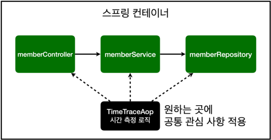

# 7. AOP (Aspect Oriented Programming)

### AOP가 필요한 상황

- 모든 메소드의 호출 시간을 측정하고 싶을 때
- 공통 관심 사항 vs 핵심 관심 사항
- 회원 가입 시간, 회원 조회 시간을 측정하고 싶을 때

### AOP를 사용하지 않으면 …

- 회원가입, 회원 조회에 시간을 측정하는 기능은 핵심 관심 사항이 아니다.
- 시간을 측정하는 로직은 공통 관심 사항이다.
- 시간을 측정하는 로직과 핵심 비즈니스의 로직이 섞여서 유지보수가 어렵다.
- 시간을 측정하는 로직을 별도의 공통 로직으로 만들기 매우 어렵다.
- 시간을 측정하는 로직을 변경할 때 모든 로직을 찾아가면서 변경해야 한다.



### AOP 적용

- 공통 관심 사항과 핵심 관심 사항을 분리한다.
- AOP를 추가할 때는 Aspect 어노테이션을 선언해야한다.
- AOP를 추가할 때는 스프링 컨테이너에 빈으로 등록되도록 설정해야한다.
    - 해당 클래스에 @Component 어노테이션을 붙이거나, SpringConfig 파일에 직접 AOP를 등록한다.
- AOP를 추가할 때는 해당 클래스에 어노테이션을 붙이기 보다는 SpringConfig 파일에 직접 등록하여 한 번에 찾기 쉽도록 해준다.
- AOP 메소드에 Around 어노테이션을 등록하여 어떤 조건에서 AOP 메소드가 동작할지 설정한다.
- 회원가입, 회원 조회등 핵심 관심사항과 시간을 측정하는 공통 관심 사항을 분리한다.
- 시간을 측정하는 로직을 별도의 공통 로직으로 만들었다.
- 핵심 관심 사항을 깔끔하게 유지할 수 있다.
- 변경이 필요하면 이 로직만 변경하면 된다.
- 원하는 적용 대상을 선택할 수 있다.

### 코드

```java
package hello.hellospring.aop;

import org.aspectj.lang.ProceedingJoinPoint;
import org.aspectj.lang.annotation.Around;
import org.aspectj.lang.annotation.Aspect;
import org.springframework.stereotype.Component;

@Component
@Aspect
public class TimeTraceAop {

    @Around("execution(* hello.hellospring..*(..))")
    public Object execute(ProceedingJoinPoint joinPoint) throws Throwable {
        long start = System.currentTimeMillis();
        System.out.println("Start : " + joinPoint.toString());
        try {
            return joinPoint.proceed();
        } finally {
            long finish = System.currentTimeMillis();
            long timeMs = finish - start;
            System.out.println("END : " + joinPoint.toString() + " " + timeMs + "ms");
        }
    }
}
```